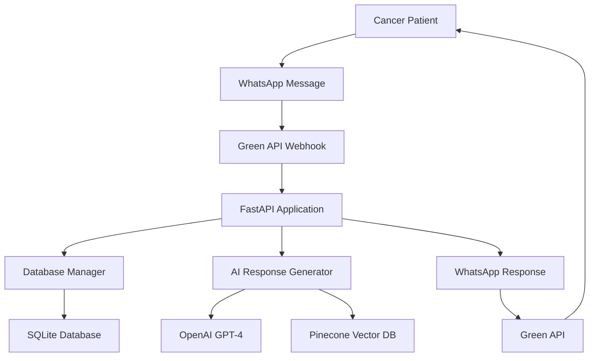

# 🎗️ Cancer Patient Support RAG Chatbot

An advanced AI-powered WhatsApp chatbot designed to provide compassionate support, accurate information, and guidance to cancer patients and their families. Built with state-of-the-art RAG (Retrieval Augmented Generation) technology, this chatbot serves as a supportive companion throughout the cancer journey while maintaining clear boundaries about medical advice.


## 🌟 Key Features

### 🤖 **Advanced AI Capabilities**
- **Context-Aware Support**: Maintains conversation history for personalized interactions
- **Medical RAG System**: Retrieves information from curated medical resources
- **Intent Recognition**: Understands different types of patient needs and concerns
- **Safety-First Responses**: Always includes medical disclaimers and safety guidelines

### 🏥 **Patient Support Areas**
- **Treatment Information**: General guidance about chemotherapy, radiation, surgery, immunotherapy
- **Side Effect Management**: Practical tips for managing nausea, fatigue, pain, and other symptoms
- **Nutritional Support**: Diet recommendations and meal planning during treatment
- **Emotional Wellbeing**: Coping strategies, stress management, and mental health resources
- **Healthcare Navigation**: Insurance guidance, clinical trials, financial assistance information
- **Caregiver Support**: Resources and advice for family members and caregivers

### 💾 **Robust Data Management**
- **SQLite Database**: Secure, local storage for all conversations
- **User Profiles**: Track patient interactions and preferences
- **Conversation Analytics**: Monitor usage patterns and improve responses
- **HIPAA-Conscious Design**: Privacy-focused architecture with local data storage

### 🛡️ **Safety & Compliance**
- **Medical Disclaimers**: Automatic inclusion of safety warnings
- **Emergency Resources**: Quick access to crisis helplines and emergency contacts
- **Boundary Maintenance**: Clear separation between support and medical advice
- **Privacy Protection**: No external data sharing, local storage only

## 🏗️ Architecture



## 🛠️ Technology Stack

### Core Technologies
- **Python 3.8+**: Main programming language
- **FastAPI**: Modern, fast web framework for APIs
- **SQLite**: Secure local database for patient conversations
- **Pydantic**: Data validation and settings management

### AI & ML Services
- **OpenAI GPT-4**: Advanced language model for empathetic responses
- **OpenAI Embeddings**: Text embeddings for semantic search
- **Pinecone**: Managed vector database for medical information retrieval

### Communication & Integration
- **Green API**: WhatsApp Business API integration
- **Tiktoken**: Token counting and management for OpenAI models
- **Uvicorn**: ASGI server for production deployment

## 📋 Prerequisites

- Python 3.8 or higher
- OpenAI API account with GPT-4 access
- Pinecone account for vector database
- Green API account for WhatsApp integration
- Basic understanding of cancer care (for content curation)

## 🚀 Quick Start

### 1. Clone the Repository
```bash
git clone https://github.com/your-username/cancer-support-chatbot.git
cd cancer-support-chatbot
```

### 2. Create Virtual Environment
```bash
python -m venv cancer_bot_env
source cancer_bot_env/bin/activate  # On Windows: cancer_bot_env\Scripts\activate
```

### 3. Install Dependencies
```bash
pip install -r requirements.txt
```

### 4. Set Up Environment Variables
Create a `.env` file in the project root:
```env
# OpenAI Configuration
OPENAI_API_KEY=your_openai_api_key_here

# Pinecone Configuration
PINECONE_API_KEY=your_pinecone_api_key_here

# Green API Configuration
GREEN_API_INSTANCE_ID=your_green_api_instance_id
GREEN_API_ACCESS_TOKEN=your_green_api_access_token

# Application Settings
PORT=8000
DEBUG=False
```

### 5. Initialize the Application
```bash
python cancer_chatbot.py
```

The application will:
- Create the SQLite database automatically
- Initialize Pinecone index
- Populate sample medical documents
- Start the FastAPI server on `http://localhost:8000`

### 6. Configure Webhook
Set your Green API webhook URL to:
```
https://your-domain.com/webhook
```

## 🔧 Service Setup Guides

### 🤖 **OpenAI API Setup**

OpenAI provides access to GPT-4 and embedding models for natural language processing.

**What it does:**
- Generates empathetic, contextual responses to patient questions
- Creates embeddings for medical document retrieval
- Maintains conversation context across interactions

**Setup Steps:**
1. Visit [OpenAI Platform](https://platform.openai.com/)
2. Create an account and add billing information
3. Generate an API key in the [API Keys section](https://platform.openai.com/api-keys)
4. Set usage limits to control costs
5. Add the API key to your `.env` file

**Important Notes:**
- GPT-4 access requires a paid account with previous API usage
- Monitor usage to avoid unexpected costs
- Consider using GPT-3.5-turbo for development/testing

**Useful Links:**
- [OpenAI Documentation](https://platform.openai.com/docs)
- [API Reference](https://platform.openai.com/docs/api-reference)
- [Pricing Information](https://openai.com/pricing)
- [Usage Dashboard](https://platform.openai.com/usage)

### 📌 **Pinecone Vector Database**

Pinecone stores and indexes medical information for intelligent retrieval.

**What it does:**
- Indexes medical documents, treatment guides, and support resources
- Enables semantic search for relevant patient information
- Provides fast, accurate retrieval for RAG implementation

**Setup Steps:**
1. Visit [Pinecone Console](https://app.pinecone.io/)
2. Create a free account (includes generous free tier)
3. Create a new index:
   - **Index Name**: `cancer-support-db`
   - **Dimensions**: `1536` (for OpenAI ada-002 embeddings)
   - **Metric**: `cosine`
   - **Environment**: Select your preferred region
4. Get your API key from the dashboard
5. Add to your `.env` file

**Free Tier Limits:**
- 1 index with up to 100k vectors
- Up to 5MB of metadata per vector
- Sufficient for most cancer support applications

**Useful Links:**
- [Pinecone Documentation](https://docs.pinecone.io/)
- [Python Client Guide](https://docs.pinecone.io/docs/python-client)
- [Pricing Plans](https://www.pinecone.io/pricing/)
- [Best Practices](https://docs.pinecone.io/docs/performance-tuning)

### 💚 **Green API (WhatsApp Integration)**

Green API enables WhatsApp Business communication without complex Meta verification.

**What it does:**
- Sends and receives WhatsApp messages
- Provides webhook support for real-time conversations
- Manages WhatsApp Business account integration

**Setup Steps:**
1. Visit [Green API](https://green-api.com/)
2. Create an account and select a plan
3. Create a new instance:
   - Link your WhatsApp Business number
   - Configure instance settings
   - Get Instance ID and Access Token
4. Set up webhook in the dashboard:
   ```
   Webhook URL: https://your-domain.com/webhook
   ```
5. Test the connection with the provided tools

**Plan Recommendations:**
- **Developer**: Good for testing and small-scale deployment
- **Standard**: Suitable for production use
- **Business**: For high-volume applications

**Useful Links:**
- [Green API Documentation](https://green-api.com/docs/)
- [API Methods Reference](https://green-api.com/docs/api/)
- [Webhook Configuration](https://green-api.com/docs/api/receiving/)
- [Pricing Plans](https://green-api.com/tariffs/)

## 📁 Project Structure

```
cancer-support-chatbot/
├── cancer_chatbot.py          # Main application file
├── requirements.txt           # Python dependencies
├── .env                      # Environment variables (create this)
├── conversations.db          # SQLite database (auto-generated)
├── cancer_chatbot.log        # Application logs (auto-generated)
├── README.md                 # This file
├── docs/
│   ├── medical-guidelines.md # Medical content guidelines
│   ├── api-documentation.md  # API endpoint documentation
│   ├── deployment-guide.md   # Production deployment guide
│   └── content-curation.md   # Guide for adding medical content
├── content/
│   ├── treatment-guides/     # Treatment information documents
│   ├── side-effects/        # Side effect management resources
│   ├── nutrition/           # Nutritional guidance materials
│   ├── emotional-support/   # Mental health and coping resources
│   └── emergency/           # Crisis resources and contacts
└── scripts/
    ├── populate_knowledge.py # Script to populate medical knowledge base
    ├── backup_conversations.py # Backup patient conversations
    └── content_validator.py   # Validate medical content accuracy
```

## 🌐 API Endpoints

### Core Endpoints
- `POST /webhook` - WhatsApp message webhook
- `GET /health` - System health check
- `GET /stats` - Usage statistics and analytics

### Content Management
- `POST /add-document` - Add medical documents to knowledge base
- `GET /documents` - List available documents
- `DELETE /document/{doc_id}` - Remove document from knowledge base

### Patient Management (Admin)
- `GET /patients` - List patient interactions (anonymized)
- `POST /patient/{patient_id}/reset` - Reset patient conversation
- `GET /patient/{patient_id}/export` - Export patient conversation

### Analytics & Monitoring
- `GET /analytics` - Detailed usage analytics
- `GET /health-check` - Comprehensive system status
- `POST /emergency-broadcast` - Send emergency information to patients

## 🏥 Medical Content Guidelines

### Content Curation Best Practices
1. **Source Verification**: Only use information from reputable medical organizations
2. **Regular Updates**: Medical information changes frequently
3. **Cultural Sensitivity**: Consider diverse patient backgrounds
4. **Plain Language**: Use patient-friendly terminology
5. **Disclaimer Inclusion**: Always include appropriate medical disclaimers

### Recommended Sources
- **National Cancer Institute (NCI)**
- **American Cancer Society**
- **World Health Organization (WHO)**
- **Mayo Clinic**
- **National Comprehensive Cancer Network (NCCN)**
- **Local oncology hospitals and cancer centers**

### Content Categories
```python
content_categories = {
    "treatment": "General treatment information",
    "side_effects": "Managing treatment side effects", 
    "nutrition": "Diet and nutrition guidance",
    "emotional_support": "Mental health and coping",
    "caregiver": "Resources for family and caregivers",
    "financial": "Insurance and financial assistance",
    "emergency": "Crisis resources and emergency contacts"
}
```

## 💾 Database Schema

### Conversations Table
```sql
CREATE TABLE conversations (
    id INTEGER PRIMARY KEY AUTOINCREMENT,
    user_id TEXT NOT NULL,
    message TEXT NOT NULL,
    response TEXT NOT NULL,
    timestamp DATETIME NOT NULL,
    session_id TEXT,
    FOREIGN KEY (user_id) REFERENCES user_profiles (user_id)
);
```

### User Profiles Table
```sql
CREATE TABLE user_profiles (
    user_id TEXT PRIMARY KEY,
    phone_number TEXT,
    first_interaction DATETIME,
    last_interaction DATETIME,
    total_messages INTEGER DEFAULT 0
);
```

## 🎯 Usage Examples

### Patient Interaction Flow
```
Patient: "I just started chemotherapy and feeling very nauseous"
Bot: "I understand how challenging nausea can be during chemotherapy. 
     Here are some strategies that many patients find helpful:
     
     1. Take anti-nausea medications as prescribed, even before feeling sick
     2. Eat small, frequent meals throughout the day
     3. Try ginger tea or ginger candies
     4. Avoid strong odors and spicy foods
     
     ⚠️ Please discuss persistent nausea with your healthcare team, 
     as they may need to adjust your anti-nausea medications."

Patient: "Thank you, that's helpful. What about fatigue?"
Bot: "I remember you mentioned starting chemotherapy. Fatigue is very 
     common and can be one of the most challenging side effects..."
```

### Adding Medical Content
```python
import requests

# Add a new medical document
response = requests.post('http://localhost:8000/add-document', json={
    'content': 'Chemotherapy side effects vary by treatment type...',
    'title': 'Managing Chemotherapy Side Effects',
    'source': 'National Cancer Institute',
    'category': 'treatment'
})
```

## 🚀 Deployment Options

### Local Development
```bash
# Install dependencies
pip install -r requirements.txt

# Set environment variables
export OPENAI_API_KEY=your_key_here

# Run the application
python cancer_chatbot.py
```

### Docker Deployment
```dockerfile
FROM python:3.9-slim

WORKDIR /app

COPY requirements.txt .
RUN pip install --no-cache-dir -r requirements.txt

COPY . .

EXPOSE 8000

CMD ["python", "cancer_chatbot.py"]
```

```bash
# Build and run
docker build -t cancer-support-bot .
docker run -p 8000:8000 --env-file .env cancer-support-bot
```

### Cloud Deployment

#### Heroku
```bash
# Create Heroku app
heroku create cancer-support-bot

# Set environment variables
heroku config:set OPENAI_API_KEY=your_key
heroku config:set PINECONE_API_KEY=your_key
heroku config:set GREEN_API_INSTANCE_ID=your_id
heroku config:set GREEN_API_ACCESS_TOKEN=your_token

# Deploy
git push heroku main
```

#### Railway
1. Connect your GitHub repository to Railway
2. Set environment variables in Railway dashboard
3. Deploy automatically on git push

#### AWS/Google Cloud/Azure
- Use container services (ECS, Cloud Run, Container Instances)
- Set up environment variables through cloud console
- Configure health checks and monitoring

## 📊 Monitoring & Analytics

### Built-in Metrics
- **Patient Engagement**: Message volume and frequency
- **Response Quality**: Average response times and satisfaction
- **Content Usage**: Most accessed medical information
- **Safety Monitoring**: Emergency resource access patterns

### Health Monitoring
```bash
# Check system status
curl http://your-domain.com/health

# Get usage statistics
curl http://your-domain.com/stats

# Monitor response times
curl -w "@curl-format.txt" -o /dev/null -s http://your-domain.com/health
```

### Logging and Alerts
```python
# Configure logging levels
logging.basicConfig(
    level=logging.INFO,
    format='%(asctime)s - %(name)s - %(levelname)s - %(message)s'
)

# Set up alerts for:
# - High error rates
# - Unusual usage patterns
# - Emergency keyword usage
# - System performance issues
```

## 🔒 Security & Privacy

### Data Protection
- **Local Storage**: All conversations stored in local SQLite database
- **No PHI Sharing**: No protected health information sent to third parties
- **Encryption**: Secure data transmission and storage
- **Access Controls**: Admin-only access to patient data

### Privacy Best Practices
```python
# Data anonymization
def anonymize_patient_data(data):
    # Remove or hash personal identifiers
    # Keep only necessary information for support
    pass

# Regular data cleanup
def cleanup_old_conversations(days=90):
    # Remove conversations older than specified days
    pass
```

### Compliance Considerations
- **HIPAA Awareness**: Designed with healthcare privacy in mind
- **GDPR Compliance**: Right to data deletion and export
- **Medical Disclaimers**: Clear boundaries about medical advice
- **Emergency Protocols**: Crisis intervention procedures

## 🚨 Emergency Features

### Crisis Detection
```python
emergency_keywords = [
    "suicidal", "end my life", "can't go on", "give up",
    "emergency", "urgent", "severe pain", "can't breathe"
]
```

### Emergency Response
- Immediate crisis resource information
- Emergency hotline numbers
- Instructions to seek immediate medical care
- Escalation protocols for severe situations

### Emergency Contacts
```python
emergency_resources = {
    "suicide_prevention": "988",
    "crisis_text": "Text HOME to 741741",
    "cancer_helpline": "1-800-227-2345",
    "emergency_services": "911"
}
```

## 🧪 Testing

### Unit Tests
```bash
# Run all tests
python -m pytest tests/

# Run specific test categories
python -m pytest tests/test_ai_responses.py
python -m pytest tests/test_database.py
python -m pytest tests/test_emergency.py
```

### Integration Tests
```python
# Test complete conversation flow
def test_patient_conversation_flow():
    # Simulate multi-turn conversation
    # Verify context maintenance
    # Check medical disclaimers
    pass
```

### Content Validation
```bash
# Validate medical content accuracy
python scripts/content_validator.py

# Check for outdated information
python scripts/content_audit.py
```

## 🤝 Contributing

We welcome contributions from healthcare professionals, developers, and cancer survivors.

### Contribution Areas
- **Medical Content**: Curating accurate, helpful resources
- **Feature Development**: New chatbot capabilities
- **Translations**: Multi-language support
- **Testing**: Quality assurance and edge case handling
- **Documentation**: Improving guides and documentation

### Development Setup
```bash
# Clone repository
git clone https://github.com/your-username/cancer-support-chatbot.git
cd cancer-support-chatbot

# Create development environment
python -m venv dev_env
source dev_env/bin/activate

# Install development dependencies
pip install -r requirements-dev.txt

# Set up pre-commit hooks
pre-commit install

# Run tests
python -m pytest
```

### Medical Content Contributions
1. Verify information with reputable medical sources
2. Include proper attribution and source links
3. Use patient-friendly language
4. Follow content guidelines in `docs/content-curation.md`

## 📝 License

This project is licensed under the MIT License - see the [LICENSE](LICENSE) file for details.

## ⚠️ Important Disclaimers

### Medical Disclaimer
This chatbot is designed to provide general information and support to cancer patients and their families. It is **NOT** intended to:
- Replace professional medical advice
- Provide medical diagnoses
- Recommend specific treatments
- Handle medical emergencies

**Always consult with qualified healthcare professionals for medical decisions.**

### Limitations
- Information may become outdated
- Responses are generated by AI and may contain errors
- Not suitable for emergency medical situations
- Cannot replace human healthcare providers

## 🙏 Acknowledgments

### Medical Advisory
- **Oncology professionals** who provided guidance on content accuracy
- **Cancer survivors** who shared their experiences and feedback
- **Healthcare organizations** that provide reliable cancer information

### Technology Partners
- **OpenAI** for advanced language model capabilities
- **Pinecone** for vector database infrastructure
- **Green API** for WhatsApp integration services

### Open Source Community
- Contributors to medical AI research
- Healthcare technology developers
- Privacy and security experts

## 📞 Support & Contact

### Getting Help
- 📖 [Documentation Wiki](https://github.com/your-username/cancer-support-chatbot/wiki)
- 🐛 [Issue Tracker](https://github.com/your-username/cancer-support-chatbot/issues)
- 💬 [Community Discussions](https://github.com/your-username/cancer-support-chatbot/discussions)
- 📧 Email: support@cancersupportbot.org

### Medical Content Questions
- 🏥 Medical Advisory Board: medical@cancersupportbot.org
- 📚 Content Suggestions: content@cancersupportbot.org

### Emerge
